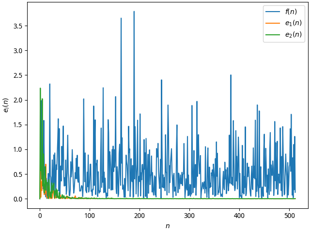

## 1

Consider an AR process $x(n)$ defined by the difference equation

$$x(n) = -a_1x(n - 1) - a_2x(n - 2) + v(n)$$

where $v(n)$ is an additive white noise of zero mean and variance
$\sigma^2_N$.The AR parameters $a_1$ and $a_2$ are both real valued:

$$[a_1 \quad a_2] = [0.1 \quad -0.8]$$

### a

Calculate the noise variance $\sigma^2_N$ such that the AR process $x(n)$ has
unit variance. Hence, generate different realization of the process $x(n)$.

---

$$\begin{aligned}
a_0 & := 1\\
\mathbf{a} & = [a_0 \quad a_1 \quad a_2]^\mathsf{T}\\
\mathbf{x}_N(n) & = [x(n) \quad x(n - 1) \quad x(n - 2)]^\mathsf{T}\\
v(n) & = \mathbf{x}_N(n)^\mathsf{T}\mathbf{a}\\
\mathbb{E}x_N(n)v(n) & = [\sigma^2_v \quad 0 \quad 0]^\mathsf{T}\\
& = \mathbf{R}_{N + 1}\mathbf{a}\\
\mathbf{R}_{N + 1} & = \bigl(r(i - j)\bigr)_{i, j = 1, 1}^{N + 1, N + 1}\\
r(i - j) & = \mathbb{E}x(n)x(n + i - j)\\
r(0) & = \sigma_x^2
\end{aligned}$$

For this 3-order linear equation, only 3 variable is unknown:
$\sigma_v^2, r(1), r(2)$. The solution is:

$$[r(1) \quad r(2) \quad \sigma^2_v] = [-0.5 \quad 0.85 \quad 0.27]$$

The $x$ is as Fig [x](#fig:x).

{#fig:x}

### b

Given the input $x(n)$, an LMS filter of length $M = 2$ is used to estimate the
unknown AR parameters $a_1$ and $a_2$. The step size $\delta$ is assigned the
value 0.05. Compute and plot the ensemble average curve of $a_1$ and $a_2$ by
averaging the value of parameters $a_1$ and $a_2$ over an ensemble of 100
different realization of the filter. Calculate the time constant according to
the experiment results and compare with the corresponded theoretical value.

---

$$\begin{aligned}
\mathbf{R}_N & = \begin{bmatrix}
1 & -0.5\\
-0.5 & 1
\end{bmatrix}\\
\mathbf{\lambda} & = \mathbf{\lambda}(\mathbf{R}_N)\\
& = [0.5 \quad 1.5]\\
\tau & = \frac{1}{\delta\lambda}\\
\tau & \in [13.3, 40]\\
a_i(n) - a_i(\infty) & =
\exp(-\frac{n - m}{\hat{\tau}})\bigl(a_i(n) - a_i(m)\bigr)\\
\hat{\tau} & \in [14, 30]\\
[14, 30] & \approx [13.3, 40]
\end{aligned}$$

The $a$ is as Fig [a](#fig:a).

{#fig:a}

### c

For one realization of the LMS filter, compute the prediction error

$$f(n) = x(n) - \hat{x}(n)$$

And the two tap-weight errors

$$e_1(n) = -a_1 - h_1(n)$$

and

$$e_2(n) = -a_2 - h_2(n)$$

Using power spectral plots of $f(n), e_1(n), e_2(n)$, show that $f(n)$ behaves
as white noise, where as $e_1(n)$ and $e_2(n)$ behave as low-pass process.
Explain the reason for this phenomenon.

---

{#fig:power_spectrum}

$$\begin{aligned}
\alpha(n) & = \mathbf{q}^\mathsf{T}(\mathbf{h}(n) - \hat{\mathbf{h}})\\
\mathbb{E}\alpha(n) & = (1 - \delta\lambda)^n\mathbb{E}\alpha(0)\\
\mathcal{F}\mathbb{E}\alpha(\Omega) & = \frac{\mathbb{E}\alpha(0)}{1 -
(1 - \delta\lambda)\exp(-\mathbb{j}\Omega)}\\
{\lvert\mathcal{F}\mathbb{E}\alpha(\Omega)\rvert}^2 & =
\frac{{\mathbb{E}\alpha(0)}^2}{1 + (1 - \delta\lambda)^2 - 2(1 - \delta\lambda)
\cos(\Omega)}
\end{aligned}$$

As Fig [power spectrum](#fig:power_spectrum), because $f(n)$ is an estimation
of $v(n)$, so $f(n)$ will tend to a white noise. According to expression of
${\lvert\mathcal{F}\mathbb{E}\alpha(\Omega)\rvert}^2$, we can know $a_i(n)$
must be a low pass signal.

### d

Compute the ensemble average learning curve of the LMS filter by averaging the
square value of the prediction error $f(n)$ over an ensemble of 100 different
realization of the filter. Calculate the time constant and residual power
according to the experiment results and compare with the corresponded
theoretical values.

---

$$\begin{aligned}
\tau & \approx \frac{1}{2\delta\bar{\lambda}}\\
& = \frac{1}{2\delta\sigma^2_x}\\
& = 10\\
J(\infty) & = \min J(1 + \frac\delta2N\sigma^2_x)\\
& = 0.2842\\
J(n) - J(\infty) & =
\exp(-\frac{n - m}{\hat{\tau}})\bigl(J(m) - J(\infty)\bigr)\\
\hat{\tau} & \approx 15\\
& \in [13.3 \quad 40]\\
\Delta J & = J(\infty) - \min J\\
& = 0.0142\\
\Delta\hat{J} & = 0.0127\\
\Delta\hat{J} & \approx \Delta J
\end{aligned}$$

{#fig:loss}

As Fig [loss](#fig:loss), in the tolerable range, the estimate of $\Delta J$
and $\tau$ is approximate to theoretical value.

## 2

设 $x(n) = x_1(n) + x_2(n)$, $x_1(n)$ 是窄带信号，定义 $x_1(n) = \sin(0.05\pi
n + \phi)$ 是在 $[0, 2\pi]$ 区间上均匀分布的随机相位。 $x_2(n)$ 是寬带信号，它是
一个零均值、方差为 1 的白噪音信号 $e(n)$ 激励一个线性滤波器而产生，其差分方程为
$x_2(n) = e(n) + 2e(n - 1) + e(n - 2)$。

### 1

计算 $x_1(n)$ 和 $x_2(n)$ 各自的自相关函数，并画出其函数图形。根据此选择合适的
延时，以实现谱线增强。

---

$$\begin{aligned}
\mathbb{E}x_1(n)x_1(n + k) & = \mathbb{E}\sin(0.05\pi n + \phi)\sin(0.05\pi(n +
k) + \phi)\\
& = -\frac12\mathbb{E}(\cos(0.05\pi(2n + k) + 2\phi) - \cos0.05\pi k)\\
& = 0.5\cos(0.05\pi k)\\
\mathbb{E}x_2(n)x_2(n + k) & = \mathbb{E}\bigl(e(n) + 2e(n - 1) + e(n - 2)\bigr)
\bigl(e(n + k) + 2e(n + k - 1) + e(n + k - 2)\bigr)\\
& = \{1, 4, \underline{6}, 4, 1\}
\end{aligned}$$

{#fig:relevant}

As Fig [relevant](#fig:relevant), when the delay $D > 3$, wide band component of $x_1,
x_2$ can be not relevant, but short band component of $x_1, x_2$ can be
relevant. So we can enhance the spectrum.

### 2

产生一个 $x(n)$ 序列。选择合适的 $\delta$ 值。让 $\hat{y}(n)$ 通过谱线增强器。
画出输出信号 $\hat{y}(n)$ 和误差信号 $e(n)$ 的波形，并分别与 $x_1(n)$ 和
$x_2(n)$ 比较。

---

{#fig:x1}

{#fig:x2}

As Fig [x1](#fig:x1) and [x2](#fig:x2), we let iteration number $N = 50000$,
and only display the result about last 50 iterations. Learning rate $\delta = 4
\times 10^{-6}$, and order of filter $L = 400$. We can see $\hat{x}_i(n)
\rightarrow x_i(n)$. If we decrease $N, L$, the estimation error will rise. If
we increase $\delta$, the estimation error will rise, but the convergence rate
will be faster. So we go through a trade-off and determine to select this hyper
parameters.
