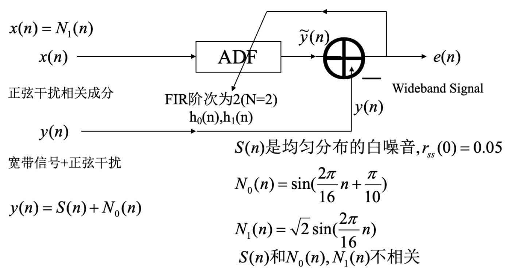

# LMS 计算机练习

传统的宽带信号中抑制正弦干扰的方法是采用陷波器(notch filter),为此我们需要精确知
道干扰正弦的频率.然而当干扰正弦频率是缓慢变化时,且选频率特性要求十分尖锐时,则最
好采用自适应噪声抵消的方法.下图是用一个二阶FIR的LMS自适应滤波器消除正弦干扰的一
个方案。

## 1

借助MATLAB画出误差性能曲面和误差性能曲面的等值曲线；

---

等值曲线见题[4](#4)

## 2

写出最陡下降法， LMS算法的计算公式($\delta = 0.4$)；

---

$$\begin{aligned}
y & = \mathbf{h}^\mathsf{T}\mathbf{x} + e\\
J(\mathbf{h}) & = \mathrm{E}e^2\\
& = \mathrm{E}y^2 - 2\mathbf{r}_{y\mathbf{x}}^\mathsf{T}\mathbf{h} +
\mathbf{h}^\mathsf{T}\mathbf{R}_\mathbf{xx}\mathbf{h}\\
\frac{\partial{J}}{\partial\mathbf{h}}\Big(\mathbf{h}\Big) & =
-2\mathrm{E}e\mathbf{x}\\
& = (\mathbf{R}_\mathbf{xx} + \mathbf{R}_\mathbf{xx}^\mathsf{T})\mathbf{h}
- 2\mathbf{r}_{y\mathbf{x}}\\
& = 2\mathbf{R}_\mathbf{xx}\mathbf{h}
- 2\mathbf{r}_{y\mathbf{x}}
\end{aligned}$$

Because $\mathbf{R}_\mathbf{xx}$ is a `Toplitz` matrix, We only need to solve
$(\mathbf{R}_\mathbf{xx})_{k0}$.

where,

$$\begin{aligned}
(\mathbf{R}_\mathbf{xx})_{k0} & =
\mathrm{E}_i\sqrt2\Big(\sin2\pi\frac{i + k}{16}\Big)
\sqrt2\sin2\pi\frac{i}{16}\\
& = \cos2\pi\frac{k}{16}\\
\mathbf{R}_\mathbf{xx} & = \begin{bmatrix}
1 & 0.9239\\
0.9239 & 1
\end{bmatrix}\\
(\mathbf{r}_{y\mathbf{x}})_k & =
\mathrm{E}_i\sqrt2\Big(\sin2\pi\frac{i + k}{16}\Big)
\sin(2\pi\frac{i}{16} + \frac{\pi}{10})\\
& = \frac1{\sqrt2}\cos(\frac{2\pi k}{16} + \frac{\pi}{10})\\
\mathbf{r}_{y\mathbf{x}} & = \begin{bmatrix}
0.6725\\
0.5377
\end{bmatrix}\\
\mathrm{E}y^2 & = 0.5 + 0.05\\
& = 0.55
\end{aligned}$$

So, 最陡下降法：

$$\begin{aligned}
\mathbf{h}(n + 1) & = \mathbf{h}(n) -
\frac\delta2 \frac{\partial{J}}{\partial\mathbf{h}}\Big(\mathbf{h}(n)\Big)\\
& = \mathbf{h}(n) + \delta\mathrm{E}e(n)\mathbf{x}(n)\\
& = \mathbf{h}(n) + \delta(\mathbf{r}_{y\mathbf{x}} -
\mathbf{R}_\mathbf{xx}\mathbf{h}(n))
\end{aligned}$$

LMS：

$$\begin{aligned}
\mathbf{h}(n + 1) & = \mathbf{h}(n) + \delta e(n)\mathbf{x}(n)\\
\end{aligned}$$

## 3

用MATLAB产生方差为0.05,均值为0白噪音$S(n)$，并画出其中一次实现的波形图；

---

## 4

根据2）中的公式，并利用3）中产生的$S(n)$，在1）中的误差性能曲面的等值曲线上叠加画出采用最陡下降法， LMS法时$H(n)$的在叠代过程中的轨迹曲线。

---

注意，在起点处，LMS先向左移动是正确现象，因为 `python` 数组从 0 开始，正弦信号
在 $n = 0$ 处为 0, 所以第 1 次迭代会有使 1 个方向的下降为 0 。
而 `matlab` 数组从 1 开始，不会有这种现象。

## 5

用MATLAB计算并画出LMS法时$J(n) = e^2(n)$随时间$n$的变化曲线（对 应$S(n)$的某一次的一次实现）和$e(n)$波形；某一次实现的结果并不能从统计的角度反映实验的结果的正确性，为得到具有统计特性的实验结果，可用足够多次的实验结果的平均值作为实验的结果。用MATLAB计算并画出LMS法时$J(n)$的100次实验结果的平均值随时间$n$的变化曲线。

---

{#loss}

## 6

用MATLAB计算并在1）中的误差性能曲面的等值曲线上叠加画出LMS法时100次实验中的$H(n)$的平均值的轨迹曲线；

---

见题[4](#4)

## 7

对以上实验结果给出一些你认为有价值的讨论。

（在实验中$n = 1, \ldots, N$，$N$的取值根据实验情况确定，一般选取足够大以使算法达到基本收敛，本题作业以电子文档PDF格式提供）

---

LMS 算法收敛速度比最陡下降法慢，在极值点会有严重抖动，可以通过平均缓解抖动。
